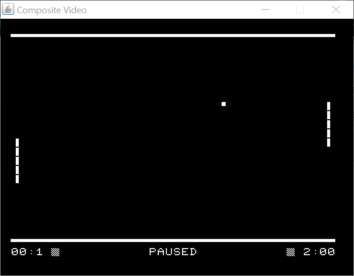
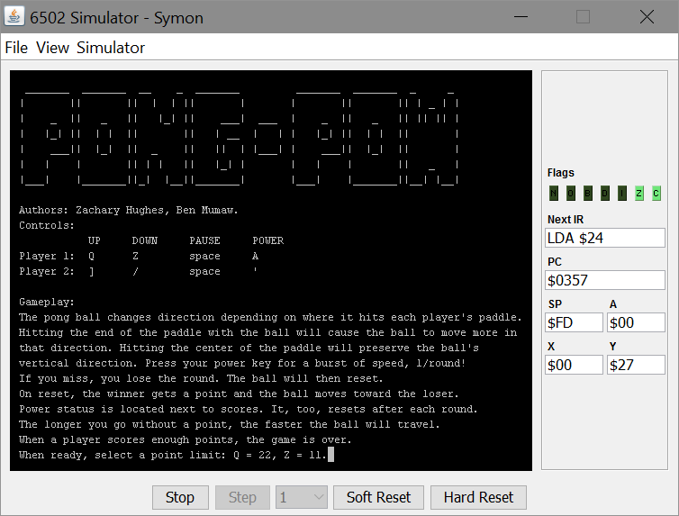

# PongPow
A 6502 assembly language version of the classic Pong

The included files, kilo.asm and kilo.prg, are group-named files for an assembly project for a class in college. They implement the classic game of pong but with a small change: gradual speedup and power shots.
Gameplay instructions are printed directly to the splash screen and are summarized here:
* Players can move the left and right paddles up and down using the *q*,*z* and *]*,*/* keys respectively. A player can perform a power shot by pressing the *a* or *'* keys.

## Running the Game
The game requires a 6502 assembler to convert the .asm file to a .prg file. A pre-assembled file is given in the repo so anyone who just wants to play the game need not install an assembler. Additionally, a 6502 virtual machine is required. Both can be found at the following links:
* [Assembler](https://github.com/sbprojects/sbasm3)
* [Symon Virtual Machine](https://github.com/sethm/symon)

Once these are installed on your machine, follow these steps to run the program:
1. Launch Symon
2. Navigate to 'File' > 'Preferences', set the program load address to 0000, and click 'Apply'
3. Select 'View' > 'Memory Window' to open the memory-mapped window
4. Click Run

**Note:** that all input must be given while the virtual machine has focus, not the memory window.
